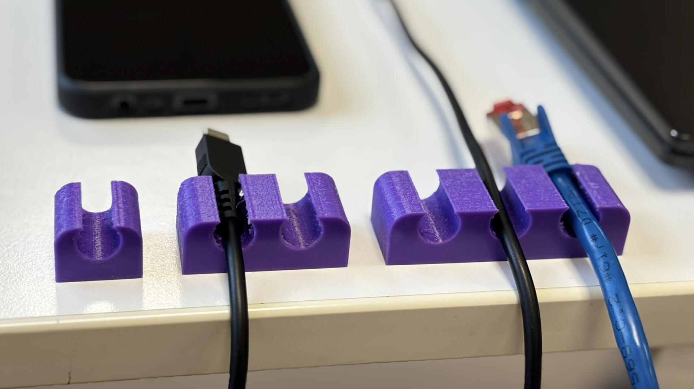

Maker Media GmbH

***

# Parametrisches Design in FreeCAD

### Wer seine CAD-Modelle parametrisch konstruiert, kann sie später flexibel und schnell modifizieren. Wie man das Aussehen eines Modells mithilfe einer Tabelle steuern kann, zeigen wir in diesem Artikel. Dafür nutzen wir die integrierte Spreadsheet-Workbench von FreeCAD.

Ergänzend zum Artikel in der Make 1/25 gibt es hier die FreeCAD-Datei mit dem Kabelhalter zum Herunterladen.

Den vollständigen Artikel kann man in der **[Make-Ausgabe 1/25](https://www.heise.de/select/make/2025/1)** lesen.
